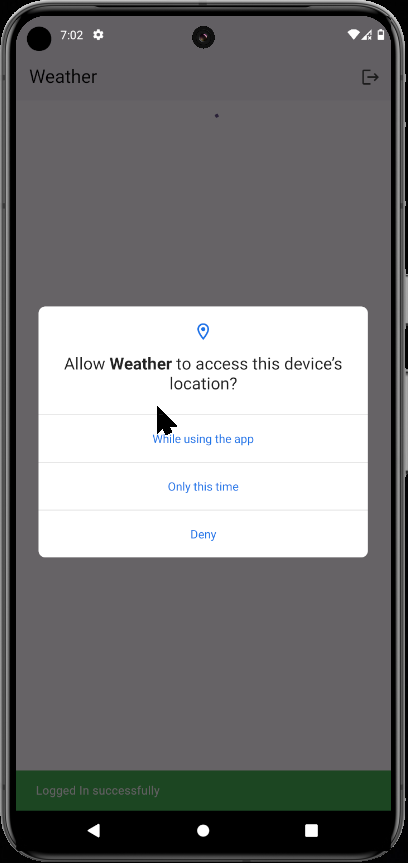
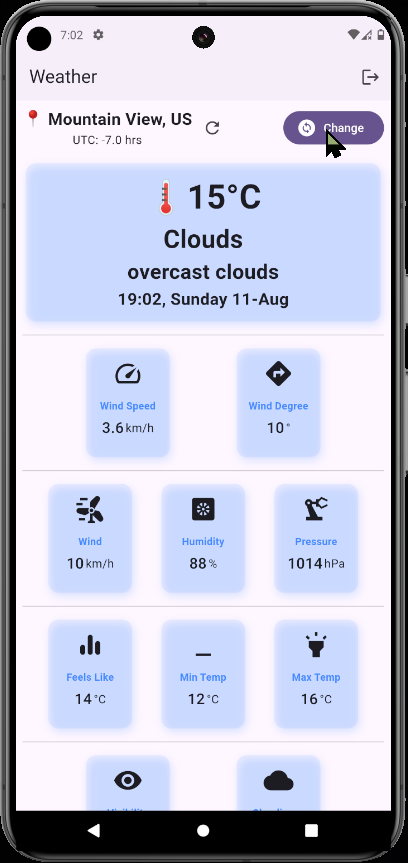
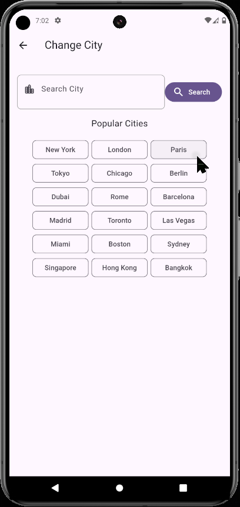
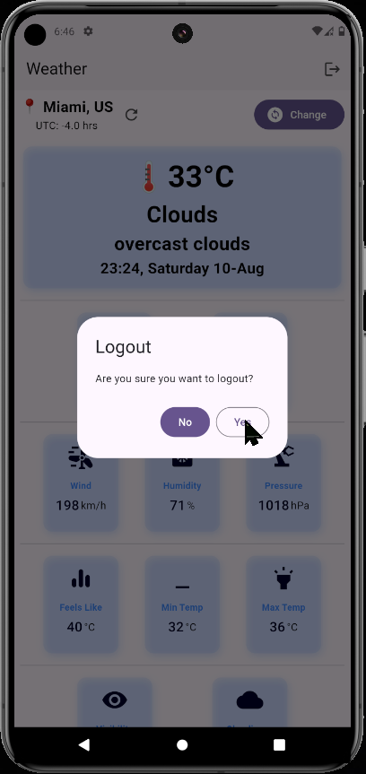

# Weather Flutter App

This is a simple weather app built with Flutter. It uses the OpenWeatherMap API to fetch the weather data. The app has the following features:

- Get the current weather of your location
- Get the weather of any city by searching for it
- Get the weather of any city by selecting it from the list of cities

## Screenshots

<div>
  
  
  
  
  
    
</div>

## Getting Started

1. Clone the repository

```bash
git clone
```

2. Get an API key from [OpenWeatherMap](https://openweathermap.org/api) and add it to the `lib/utils/constants.dart` file

```dart
const String apiKey = 'YOUR_API_KEY ';
```

3. Run the app

```bash
flutter run
```
